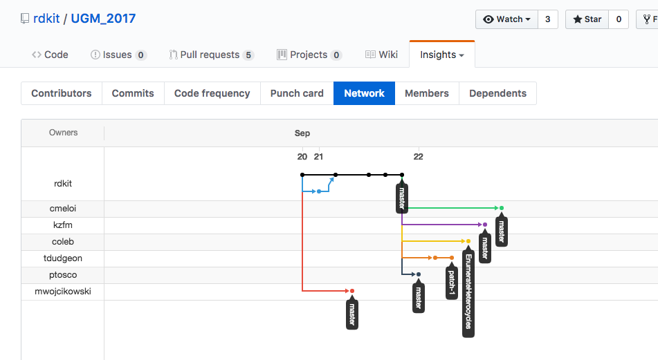

# GitHub Hands-on

## GitHubアカウントの登録

https://help.github.com/articles/signing-up-for-a-new-github-account/

## SSHの設定

https://help.github.com/articles/connecting-to-github-with-ssh/

# 前のセッションでつくったリポジトリをGitHubで管理してみよう

## 新しいリポジトリの作成

- プロファイルページの右側のnew repositoryをクリックする。 
- 基本的にpublicで(privateは有料オプション)
- gitignoreとlicenseを選択

リポジトリ作成後Readme.md作成画面が出てくる

### 既存のリポジトリをGitHubで管理する

    git remote add origin remote repository URL
    git push -u origin master

もし新規なプロジェクトだったら

    git clone repository URL

でクローンして書き始めれば良い

## forkとcloneの違い

### forkしたくなるのはどういうときか？

cloneは主にただ使いたい時に使います。自分のリポジトリがオーナーなのでクローン元にプッシュ出来ますが、
そうでない場合プッシュできません。

もし、元のプロジェクトを元に自分で開発したい場合はどうすればよいでしょうか？

そうforkすればいいのです。

GitHub のページの右上にforkというボタンがあるのでクリックすると自分のプロジェクトとして取り込まれます。
これをcloneすることで自分のプロジェクトとして開発することが可能になります。

## Pull Requestとは

さて、forkしたプロジェクトでいい感じの機能追加が出来たとします。これは良い出来なので本家(upstream)にも
取り込んでもらいたいと思うでしょう。

はい、pull request(プルリク)です。これもGitHubのページから行えます。

ちなみに某UGMは「君らのプレゼン資料プルリクしといてくれやー」って言われていたのでこんな感じになってます。

## Issueとは

バグレポートとか機能追加要望とかそんな感じのをレポートする場所です。

## ソーシャルな部分の説明

Issue報告するだけでもプロジェクトに貢献していることになるので楽しいです。
プルリクエスト送れればもっといいし、本家に取り込まれればそのままメンテしてもらえる
可能性が高いので自分のメンテコストも下がるしいいです。

## イントラでも使いたい

- [GitLab](https://about.gitlab.com/)
- [GitBucket](https://gitbucket.github.io/)
- [Gitea](https://gitea.io/en-US/)

## github-page必要？

GitHub上にサイトを作る機能があります。

https://pages.github.com/

最近[Mishima.syk](https://mishima-syk.github.io/)のサイトを作ったので、興味があればいじってみてください。

